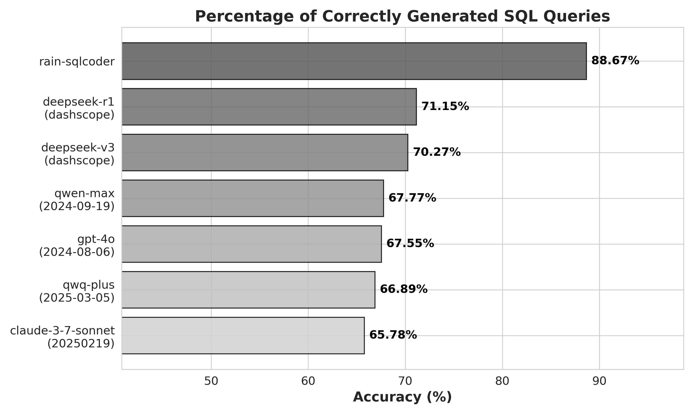

# 引言
[Rain's SQLCoder](https://huggingface.co/SuanChang/rain-SQLCoder) 是自然语言生成 SparkSQL 的 SOTA 大型语言模型（LLM），拥有 32B 参数，基于 [Qwen2.5-Coder-32B-Instruct](https://huggingface.co/Qwen/Qwen2.5-Coder-32B-Instruct) 微调。 Rain's SQLCoder 针对自然语言到 SparkSQL 转换任务进行了优化，能够有效处理最长达 32k 个 token 的上下文，尤其适用于复杂且大规模的 SQL 查询生成任务。

<p align="center">
          🤗 <a href="https://huggingface.co/SuanChang/rain-SQLCoder">Hugging Face</a> | 🖥️ <a href="https://www.suan-chang.com/">演示</a> | 💬 <a href="./figures/wechat.png">微信</a> 
</p>

[English](./README.md) | [中文](./README-zh.md)

# 提示词
Rain's SQLCoder 采用了 [Alpaca](https://github.com/tatsu-lab/stanford_alpaca) 模板，使用的提示词如下。
````
Below is an instruction that describes a task. 
Write a response that appropriately completes the request.

### Instruction:
[BEGIN OF TASK INSTRUCTION]
You are an expert in composing Spark SQL queries. You are given a user query and a set of table schemas.
Based on the user query, you need to generate one Spark SQL query to achieve the purpose.
{task description for date hint and related question and sqls}
[END OF TASK INSTRUCTION]

[BEGIN OF TABLE SCHEMAS]
{schemas}
[END OF TABLE SCHEMAS]

[BEGIN OF GENERATION HINT]
{date hint}
[END OF GENERATION HINT]

[BEGIN OF RELATED QUERIES]
{related question and sqls}
[END OF RELATED QUERIES]

[BEGIN OF FORMAT INSTRUCTION]
The output MUST strictly adhere to the following format, and NO other text MUST be included.
```sql
your output Spark SQL query
``` 
[END OF FORMAT INSTRUCTION]

[BEGIN OF QUERY]
User Query: {user question}
[END OF QUERY]

### Response:
````

# 评估
我们沿用了 [SQL-Eval](https://github.com/defog-ai/sql-eval) 中评估预测结果与标准结果的逻辑：
1. 如果预测的数据块和标准数据块完全一致，则预测结果正确；
2. 标准SQL中不包含排序逻辑，且预测数据块和标准数据块在排序之后完全一致，则预测结果正确；
3. 如果标准数据块的列是预测数据块的子集，则预测结果正确；
4. 其余情况均认为预测结果错误。

# 实验结果
我们在两个测试集上对比了Rain's SQLCoder与国内外先进自然语言大模型的生成准确率。其中，基准测试集（Benchmark Dataset）包含基础样本，而增强测试集（Enhanced Dataset）则是在基准测试集的基础上，通过分层抽样方法选取20%的样本，并补充了相关的用户查询及对应的SparkSQL语句，以评估模型在增强上下文信息下的性能表现。实验结果表明，Rain's SQLCoder在查询意图理解、SQL语法准确性和复杂查询处理等方面均展现出显著优势。

## 基准测试集


## 增强测试集


# 快速开始
我们在此处提供示例，帮助您快速掌握如何加载并使用我们的模型。
>注意: Rain's SQLCoder 只被训练用于生成 `SELECT` 语句，当表结构无法支持回答用户问题时，模型会拒绝回答。

````python
import torch
from transformers import AutoModelForCausalLM, AutoTokenizer
from utils.prompt import SQLGeneratePrompt

model_name = "SuanChang/rain-SQLCoder"

model = AutoModelForCausalLM.from_pretrained(
    model_name,
    torch_dtype=torch.bfloat16,
    device_map="auto",
)
tokenizer = AutoTokenizer.from_pretrained(model_name)

question = "What is the name of the department that offers a course that has a description including the word 'Statistics'?"
schemas = [
'''CREATE TABLE `course` (
    `crs_code` STRING,
    `dept_code` STRING,
    `crs_description` STRING,
    `crs_credit` DOUBLE
);''',
'''CREATE TABLE `department` (
    `dept_code` STRING,
    `dept_name` STRING,
    `school_code` STRING,
    `emp_num` INT,
    `dept_address` STRING,
    `dept_extension` INT
);''',
'''CREATE TABLE `student` (
    `stu_num` INT,
    `stu_lname` STRING,
    `stu_fname` STRING,
    `stu_init` STRING,
    `stu_dob` STRING,
    `stu_hrs` INT,
    `stu_class` STRING,
    `stu_gpa` DOUBLE,
    `stu_transfer` INT,
    `dept_code` STRING,
    `stu_phone` INT,
    `prof_num` INT
);'''
]
hint = "- Today is 2025-02-01."
data = dict(
    question=question,
    schema="\n\n".join(schemas),
    hint=hint,
    related_question_sqls=None,
)
text, _, _ = SQLGeneratePrompt.prompt(data)

model_inputs = tokenizer([text], return_tensors="pt").to(model.device)

generated_ids = model.generate(
    **model_inputs,
    max_new_tokens=32768
)
generated_ids = [
    output_ids[len(input_ids):] for input_ids, output_ids in zip(model_inputs.input_ids, generated_ids)
]
response = tokenizer.batch_decode(generated_ids, skip_special_tokens=True)[0]

print(response)

'''
```sql
SELECT d.dept_name FROM department d JOIN course c ON d.dept_code = c.dept_code WHERE c.crs_description LIKE '%Statistics%';
```
'''
````