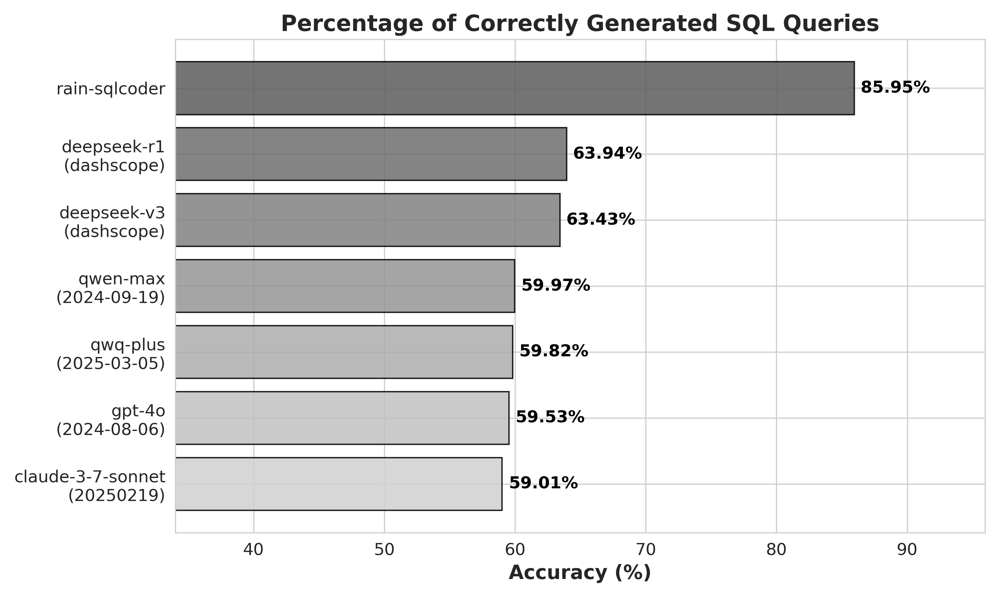
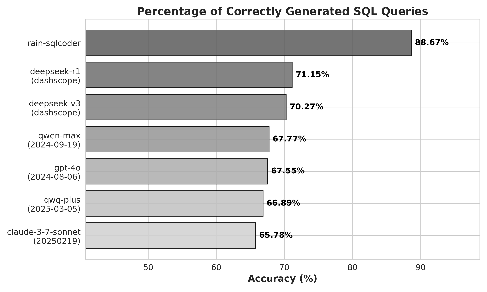

# Introduction
[Rain's SQLCoder](https://huggingface.co/SuanChang/rain-SQLCoder) is a state-of-the-art large language model (LLM) designed for natural language-to-SparkSQL generation. Rain's SQLCoder, with 32B parameters, is fine-tuned from the [Qwen2.5-Coder-32B-Instruct](https://huggingface.co/Qwen/Qwen2.5-Coder-32B-Instruct). Optimized for natural language-to-SparkSQL conversion tasks, Rain's SQLCoder effectively handles contexts of up to 32k tokens, making it particularly suitable for generating complex and large-scale SQL queries.

<p align="center">
          🤗 <a href="https://huggingface.co/SuanChang/rain-SQLCoder">Hugging Face</a> | 🖥️ <a href="https://www.suan-chang.com/">Demo</a> | 💬 <a href="./figures/wechat.png">WeChat</a> 
</p>

[English](./README.md) | [中文](./README-zh.md)

# Prompt
Rain's SQLCoder adopted the [Alpaca](https://github.com/tatsu-lab/stanford_alpaca) template, with the following prompt format.
````
Below is an instruction that describes a task. 
Write a response that appropriately completes the request.

### Instruction:
[BEGIN OF TASK INSTRUCTION]
You are an expert in composing Spark SQL queries. You are given a user query and a set of table schemas.
Based on the user query, you need to generate one Spark SQL query to achieve the purpose.
{task description for date hint and related question and sqls}
[END OF TASK INSTRUCTION]

[BEGIN OF TABLE SCHEMAS]
{schemas}
[END OF TABLE SCHEMAS]

[BEGIN OF GENERATION HINT]
{date hint}
[END OF GENERATION HINT]

[BEGIN OF RELATED QUERIES]
{related question and sqls}
[END OF RELATED QUERIES]

[BEGIN OF FORMAT INSTRUCTION]
The output MUST strictly adhere to the following format, and NO other text MUST be included.
```sql
your output Spark SQL query
``` 
[END OF FORMAT INSTRUCTION]

[BEGIN OF QUERY]
User Query: {user question}
[END OF QUERY]

### Response:
````

# Evaluation
We followed the evaluation logic from [SQL-Eval](https://github.com/defog-ai/sql-eval) to compare predicted results with ground truth:
1. If the predicted data frame exactly matches the ground truth data frame, the prediction is considered correct.
2. If the ground truth SQL does not contain sorting logic, and the predicted data frame matches the ground truth data frame after sorting, the prediction is considered correct.
3. If the columns in the ground truth data frame are a subset of the predicted data frame, the prediction is considered correct.
4. In all other cases, the prediction is considered incorrect.

# Experimental Results
We compared the generation accuracy of Rain's SQLCoder with state-of-the-art natural language large models, both domestic and international, on two test datasets. The Benchmark Dataset contains baseline samples, while the Enhanced Dataset is constructed by applying stratified sampling to 20% of the Benchmark Dataset and supplementing it with relevant user questions and corresponding SparkSQL statements to evaluate the model's performance under enhanced contextual information. The experimental results demonstrate that Rain's SQLCoder exhibits significant advantages in query intent understanding, SQL syntax accuracy, and complex query processing.

## Benchmark Dataset


## Enhanced Dataset


# Quick Start
We provide examples here to help you quickly learn how to load and use our model.
>Tips: Rain's SQLCoder is trained solely for generating `SELECT` statements, and when the table schemas cannot support answering the user's question, the model will refuse to respond.

````python
import torch
from transformers import AutoModelForCausalLM, AutoTokenizer
from utils.prompt import SQLGeneratePrompt

model_name = "SuanChang/rain-SQLCoder"

model = AutoModelForCausalLM.from_pretrained(
    model_name,
    torch_dtype=torch.bfloat16,
    device_map="auto",
)
tokenizer = AutoTokenizer.from_pretrained(model_name)

question = "What is the name of the department that offers a course that has a description including the word 'Statistics'?"
schemas = [
'''CREATE TABLE `course` (
    `crs_code` STRING,
    `dept_code` STRING,
    `crs_description` STRING,
    `crs_credit` DOUBLE
);''',
'''CREATE TABLE `department` (
    `dept_code` STRING,
    `dept_name` STRING,
    `school_code` STRING,
    `emp_num` INT,
    `dept_address` STRING,
    `dept_extension` INT
);''',
'''CREATE TABLE `student` (
    `stu_num` INT,
    `stu_lname` STRING,
    `stu_fname` STRING,
    `stu_init` STRING,
    `stu_dob` STRING,
    `stu_hrs` INT,
    `stu_class` STRING,
    `stu_gpa` DOUBLE,
    `stu_transfer` INT,
    `dept_code` STRING,
    `stu_phone` INT,
    `prof_num` INT
);'''
]
hint = "- Today is 2025-02-01."
data = dict(
    question=question,
    schema="\n\n".join(schemas),
    hint=hint,
    related_question_sqls=None,
)
text, _, _ = SQLGeneratePrompt.prompt(data)

model_inputs = tokenizer([text], return_tensors="pt").to(model.device)

generated_ids = model.generate(
    **model_inputs,
    max_new_tokens=32768
)
generated_ids = [
    output_ids[len(input_ids):] for input_ids, output_ids in zip(model_inputs.input_ids, generated_ids)
]
response = tokenizer.batch_decode(generated_ids, skip_special_tokens=True)[0]

print(response)

'''
```sql
SELECT d.dept_name FROM department d JOIN course c ON d.dept_code = c.dept_code WHERE c.crs_description LIKE '%Statistics%';
```
'''
````